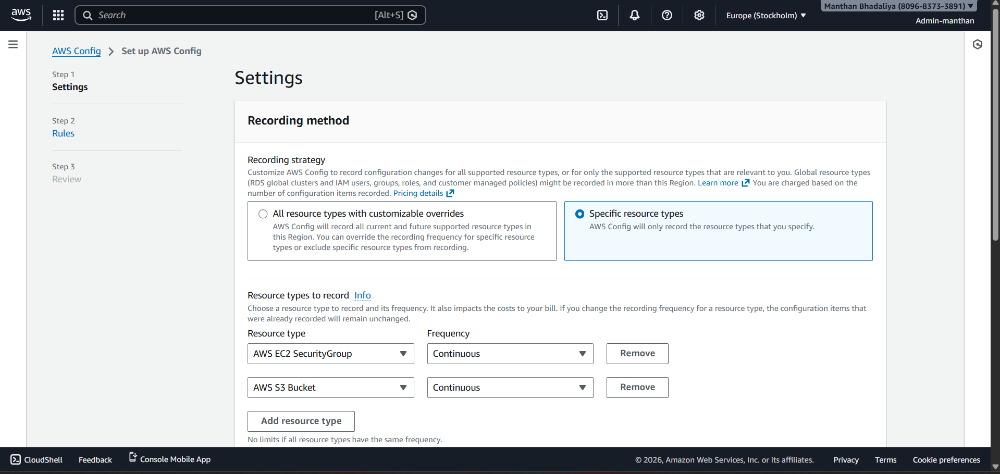
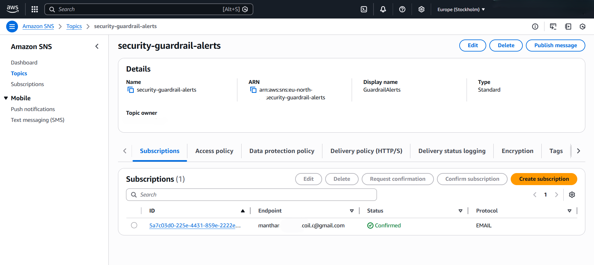
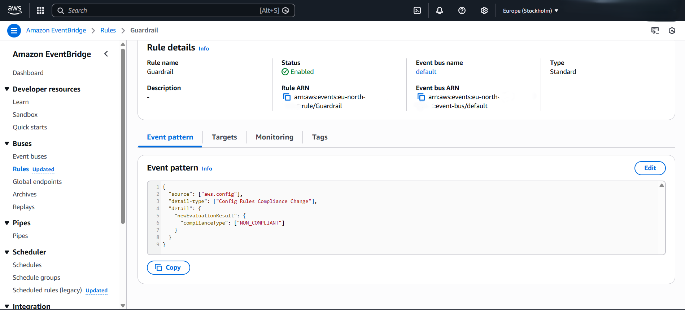
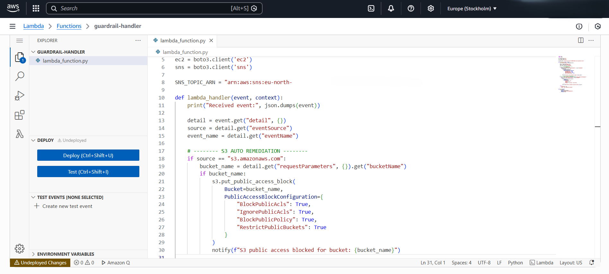
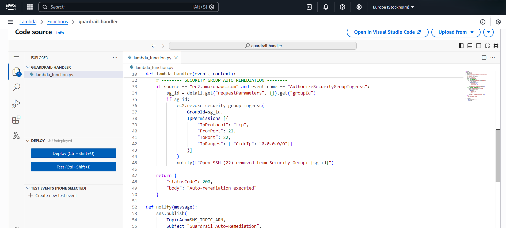
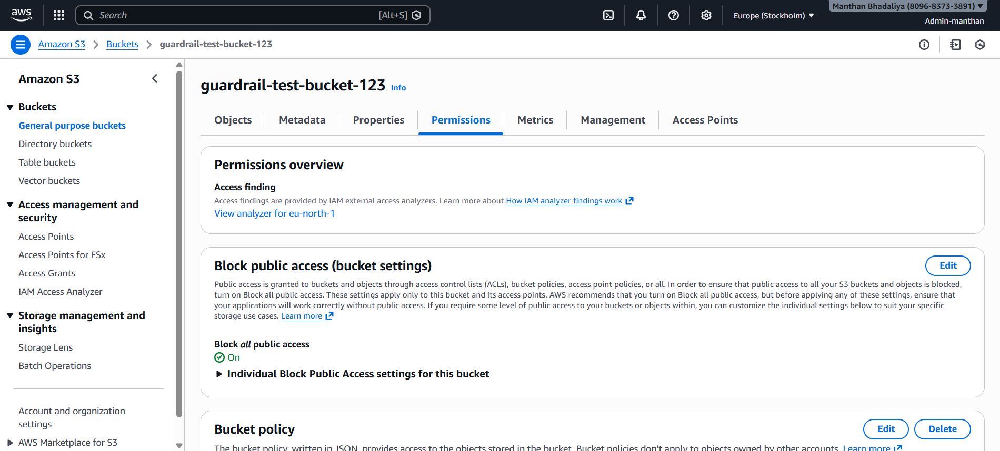
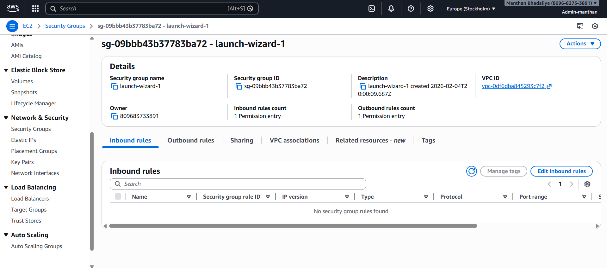

# 🔐 Automated Cloud Security Guardrails (Self-Healing AWS Security)

This project implements automated security guardrails on AWS to detect insecure configuration changes in real time and automatically remediate them.

---

## 🚀 Features
- Detects public S3 buckets and blocks public access automatically  
- Detects open SSH (0.0.0.0/0 : 22) in Security Groups and auto-removes the rule  
- Sends real-time alerts via SNS email  
- Fully serverless and event-driven architecture  

---

## 🧱 Architecture  
AWS Config → EventBridge → Lambda (Auto-Remediation) → SNS (Alert)

---

## 🎥 Demo Video

A short end-to-end demo showing:
- S3 bucket becoming public → auto-remediated
- Security Group with open SSH → rule automatically removed
- SNS email alert triggered in real time

▶️ Watch the demo:  
**[Click here to view the demo video](https://www.linkedin.com/posts/manthan-bhadaliya_aws-cloudsecurity-securityautomation-ugcPost-7425468657742319616-qvPY?utm_source=share&utm_medium=member_desktop&rcm=ACoAAEb2s7QB4HRlRBUBCk9aF-UI5BlWPFmk27w)**

---

## 🛠️ AWS Services Used
- AWS Config  
- EventBridge  
- Lambda  
- SNS  
- IAM  

---

## ⚙️ Setup Overview
1. Enable AWS Config (record S3 Buckets and EC2 Security Groups)  
2. Create SNS topic: `security-guardrail-alerts` and subscribe email  
3. Create EventBridge rules for:
   - S3 public access changes  
   - Security Group open SSH  
4. Create Lambda function: `guardrail-auto-remediate`  
   - Permissions: S3, EC2, SNS  
   - Logic: block S3 public access, remove open SSH, send SNS alerts  

---

## 🧪 How to Test

### Test 1 – S3 Public Access  
1. Make any S3 bucket public  
2. The system will automatically block public access  

### Test 2 – Open SSH Port  
1. Add inbound rule: `0.0.0.0/0 : 22`  
2. Lambda will automatically remove the rule  

---

## 📸 Screenshots (GitHub Preview)

### AWS Config Enabled  

### SNS Alerts  

### EventBridge Rule  

### Lambda Auto-Remediation  

### S3 Auto-Fix Demo  

### Security Group Auto-Fix Demo  

---
